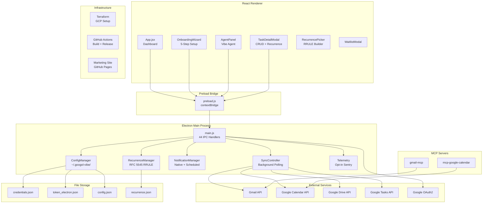

# Architecture Analysis: Googol Vibe

> Comprehensive architecture review prepared for GRIP onboarding.
> Date: 2026-03-06

## Executive Summary

Googol Vibe is a functional MVP with solid architectural foundations: proper context isolation,
unified configuration management, background sync with new-item detection, and a clean
IPC boundary. The primary gaps are in quality engineering (zero tests, no TypeScript) and
feature completeness (read-only Google integration, keyword-only agent).

The codebase is compact (~7,944 LOC across 24 files) with no dead code or abandoned features.
The architecture is sound for an MVP but needs hardening before distribution.

---

## Strengths

### 1. Clean IPC Architecture
The preload bridge (`preload.js`) properly uses `contextBridge.exposeInMainWorld` with
`contextIsolation: true`. All 44 IPC handlers follow a consistent pattern:
`ipcMain.handle(channel, async handler)` with structured request/response objects.
This is textbook Electron security practice.

### 2. Unified Configuration (ConfigManager)
`config-manager.js` is a well-designed singleton that resolves paths with a clear priority chain:
environment variable > `~/.googol-vibe/` > legacy fallbacks. It handles migration from
older storage locations, validates credential structure, and provides a debug interface.
This prevents the common Electron anti-pattern of scattered path literals.

### 3. Background Sync Controller
`sync-controller.js` implements proper polling with:
- Per-service intervals (Gmail 30s, Calendar 1m, Tasks 1m, Drive 2m)
- Overlap prevention via `syncing` flags
- New-item detection via Set-based ID tracking
- Renderer notification via IPC events

### 4. Native Notifications
The notification system supports quiet hours, category-specific settings, scheduled reminders
with lead times, and graceful degradation (`isSupported()` check). The 24-hour timeout cap
prevents 32-bit integer overflow -- a common pitfall.

### 5. Recurrence Engine
Client-side RFC 5545 RRULE implementation compensates for Google Tasks API's lack of native
recurrence. Uses the `rrule` library correctly with file-based persistence.

### 6. CI/CD Pipeline
Four GitHub Actions workflows cover PR builds, nightly pre-releases, tagged stable releases,
and marketing site deployment. The build matrix targets both macOS ARM64 and Windows.

---

## Quality Gap Matrix

Severity x Effort assessment for prioritising remediation.

| # | Gap | Severity | Effort | Priority | Notes |
|---|-----|----------|--------|----------|-------|
| 1 | Zero tests | Critical | Medium | P0 | No test framework, no CI test step |
| 2 | No TypeScript | High | High | P1 | Runtime type errors possible everywhere |
| 3 | No error boundaries | High | Low | P0 | Single widget error crashes entire app |
| 4 | No retry logic | High | Low | P0 | Google API 429/5xx = silent data loss |
| 5 | Monolithic App.jsx | Medium | Medium | P1 | 965 LOC, all state in one component |
| 6 | No file logging | Medium | Low | P1 | Console only, lost on restart |
| 7 | Agent is keyword-only | Medium | Medium | P2 | Not wired to any LLM |
| 8 | No rate limit awareness | Medium | Medium | P2 | Could exhaust Google API quotas |
| 9 | BrowserView deprecated | Low | Medium | P2 | Electron recommends WebContentsView |
| 10 | No offline support | Low | High | P3 | Requires data cache layer |
| 11 | Flask backend unused | Low | Low | P3 | Legacy web mode, not referenced by Electron |
| 12 | No accessibility | Low | Medium | P3 | No ARIA labels, no keyboard navigation |

**Priority definitions**:
- P0: Fix before any feature work (blocks reliability)
- P1: Fix within Sprint 1-2 (blocks maintainability)
- P2: Fix within Sprint 3-5 (blocks feature quality)
- P3: Fix before distribution (blocks user experience)

---

## Architecture Diagram



---

## Data Flow Analysis

### Authentication Flow

```text
User clicks "Sign In"
    -> Renderer: electronAPI.login()
    -> IPC: 'google-login'
    -> main.js: createOAuthClient()
        -> ConfigManager.getCredentialsPath()
        -> Read credentials.json
        -> Create OAuth2 client
    -> main.js: authenticateWithLoopback()
        -> Start HTTP server on port 3000
        -> Open BrowserWindow with Google auth URL
        -> User authenticates in popup
        -> Server receives callback with auth code
        -> Exchange code for tokens
        -> Save tokens to ~/.googol-vibe/tokens/token_electron.json
    -> Start SyncController with auth client
    -> Return { success: true } to renderer
```

### Background Sync Flow

```text
SyncController.start()
    -> Initial sync after 3s delay
    -> Set intervals:
        Gmail: every 30s
        Calendar: every 60s
        Tasks: every 60s
        Drive: every 120s

Each sync cycle:
    -> Check syncing flag (prevent overlap)
    -> Fetch data from Google API
    -> Compare IDs with previous sync (Set difference)
    -> If new items found:
        -> Show native notification (max 3 per service)
        -> Increment newItemCounts
        -> Send IPC event to renderer
    -> Update previousIds Set
    -> Update lastSync timestamp
```

### Recurrence Flow

```text
Hourly check via setInterval:
    -> RecurrenceManager.getDueRules()
        -> Filter rules where nextDue <= now
    -> For each due rule:
        -> Google Tasks API: create task
        -> NotificationManager: show "Recurring Task Created"
        -> RecurrenceManager.markGenerated(rule.id)
            -> Calculate next occurrence via RRULE
            -> Save to recurrence.json
        -> IPC event: 'recurring-task-generated'
```

---

## Competitor Analysis

| Feature | Googol Vibe | Wavebox | Shift | Rambox | Station |
|---------|-------------|---------|-------|--------|---------|
| Unified Google Workspace | Yes | Yes | Yes | Yes | Yes (discontinued) |
| Native desktop app | Electron | Chromium | Electron | Electron | Electron |
| Background sync | Yes (polling) | Yes (push) | No | No | No |
| Native notifications | Yes | Yes | Limited | Limited | No |
| AI agent | Keyword-only | No | No | No | No |
| Task recurrence | Yes (RRULE) | No | No | No | No |
| Offline support | No | Partial | No | No | No |
| Open source | Yes (private) | No | No | No | Yes (archived) |
| Price | Free (internal) | $12.99/mo | $4.99/mo | Free + $5/mo | Free (dead) |
| Cross-platform | macOS + Windows | macOS + Windows + Linux | macOS + Windows | macOS + Windows + Linux | macOS + Windows + Linux |

### Competitive Advantages
1. **AI agent integration** -- none of the competitors have an in-app AI assistant
2. **Task recurrence** -- client-side RRULE fills a Google Tasks gap
3. **Background sync with notifications** -- most competitors just embed web views
4. **Open source (internal)** -- full control, no vendor lock-in
5. **Swiss Nihilism design** -- distinctive visual identity vs generic competitors

### Competitive Gaps
1. **No Gmail compose** -- competitors allow sending emails
2. **No calendar creation** -- read-only limits utility
3. **No push notifications** -- polling adds latency vs WebSocket/push
4. **No Linux support** -- CI builds macOS + Windows only
5. **No multi-account** -- competitors support multiple Google accounts

---

## Security Assessment

### Strengths
- Context isolation enabled (`contextIsolation: true`)
- CSP headers set in production mode
- Persistent session partition (`persist:googolvibe`)
- Permission handler restricts to media/notifications only
- Sentry filters PII from error reports
- No remote code execution vectors

### Concerns
- OAuth tokens stored as plain JSON files (no OS keychain integration)
- No certificate pinning for Google API calls
- `server-destroy` package patches the HTTP server prototype
- Flask backend has no authentication (CORS only)
- No input sanitisation on agent queries

### Recommendations
1. Store tokens in OS keychain (`keytar` or `safeStorage`)
2. Add input length limits to agent queries
3. Deprecate Flask backend or add API key auth
4. Audit `server-destroy` for supply chain risk (small package, 1 maintainer)

---

## Performance Observations

### Sync Intervals
Gmail polls every 30 seconds. For a personal dashboard this is aggressive and may
contribute to rate limit exhaustion on shared quotas. Consider increasing to 60s
or implementing Google Push Notifications (Pub/Sub) for near-real-time updates.

### Memory
Each BrowserView for content viewing (Meet, Docs) creates a separate renderer process.
This is expected Electron behaviour but can consume 200-400 MB per view. The `close-content`
handler destroys the view, but there is no idle timeout.

### Startup
The app initialises ConfigManager, RecurrenceManager, NotificationManager, and Telemetry
synchronously at startup before creating the window. This is sequential but fast given
the file-based storage. No blocking network calls during startup.

---

## Recommended Architecture Evolution

### Short Term (Sprint 1-3)
1. Extract App.jsx into widget components (GmailWidget, CalendarWidget, etc.)
2. Add error boundaries per widget
3. Add retry wrapper for Google API calls
4. Set up Vitest + first 10 tests

### Medium Term (Sprint 4-7)
1. TypeScript migration (leaves first: telemetry -> config -> recurrence -> notifications -> sync)
2. Wire agent to Claude API
3. Add write scopes (compose email, create event)
4. Implement offline cache layer

### Long Term (Sprint 8-10)
1. Replace polling with Google Pub/Sub push notifications
2. Multi-account support
3. Plugin architecture for additional services (Notion, Slack, Linear)
4. WebContentsView migration (BrowserView deprecated)
